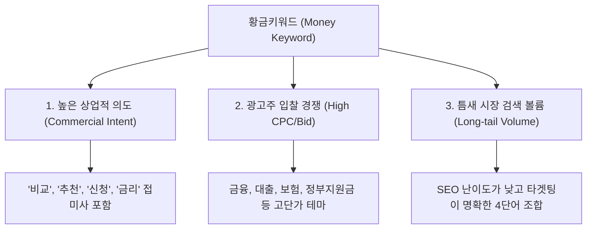

# 💰 애드센스 고단가 황금키워드(Money Keyword) 발굴 & 수익화 마스터 바이블

본 가이드는 15년차 SEO 전문가이자 애드센스 수익화 컨설턴트의 관점에서, 단순히 조회수만 높은 무의미한 트래픽이 아닌 **실제 고단가 클릭(High CPC)과 고효율 전환(High Conversion)**을 이끌어내기 위한 황금키워드 추출 방법론 및 연계 전략을 집대성한 공식 문서입니다.

---

## 🎯 1. 고단가 황금키워드의 3대 핵심 요건

단순히 검색량이 많다고 해서 돈이 되는 것은 아닙니다. 진정한 '머니 키워드'는 다음 3가지 요소를 동시에 충족해야 합니다.



---

## 📊 2. 머니 키워드 평가 및 등급 기준 (Score System)

각 키워드는 다음과 같은 100점 만점 기준의 엄격한 가중치 배점으로 평가되어 등급이 결정됩니다.

| 평가 항목 | 배점 | 상세 평가 기준 |
| :--- | :---: | :--- |
| **광고 단가 (CPC)** | **30점** | 구글 키워드 플래너 기준 페이지 상단 입찰가(고단가 범위) 반영 |
| **구매 및 전환 의도** | **20점** | 검색어가 실질적인 가입, 신청, 결제, 전화 문의 등으로 이어질 확률 |
| **광고주 경쟁도** | **20점** | 해당 키워드에 입찰 중인 구글 애즈 광고주의 수 및 입찰 강도 |
| **검색량 (Traffic)** | **20점** | 월간 검색 볼륨이 지속 가능하며 정보성 트래픽을 지속 공급할 수 있는지 여부 |
| **수익화 가능성 (CPA/CPS)** | **10점** | 제휴 마케팅 링크나 애드센스 외 추가 비즈니스 모델로의 확장성 |

### 🏆 키워드 등급 판정표
* **S급 (90점 이상)**: ★★ ★ ★ ★ | 즉시 장문 포스팅 작성 및 상단 고정 필수 (월 1,000달러 파이프라인의 핵심)
* **A급 (80~89점)**: ★★ ★ ★ ☆ | 경쟁이 비교적 적은 틈새 롱테일 키워드로, 안정적인 연금형 트래픽 확보 용이
* **B급 (60~79점)**: ★★ ★ ☆ ☆ | 메인 키워드를 보조하는 내부 링크 연결용 정보성 콘텐츠에 적합
* **C급 (60점 미만)**: ★★ ☆ ☆ ☆ | 단순 시사/일반 상식 키워드로 단가가 낮으므로 우선순위 배제

---

## 🚀 3. 카테고리별 테마 및 우선순위 (Targeting Strategy)

### 🥇 초고단가 카테고리 (우선순위 ★★★★★)
> **금융, 보험, 대출, 세금, 부동산, 법률, 정부지원금, 건강/의학, 창업, B2B SaaS**
* **이유**: 사용자가 즉각적인 재정적 혜택이나 법률/의학적 해결책을 갈구하므로 광고주가 클릭당 수만 원의 입찰가를 지불하는 대표적 영역입니다.

### 🥈 중단가 카테고리 (우선순위 ★★★★☆)
> **투자/주식/ETF, 신용카드 발급, 신차/중고차 비교, IT 디바이스 리뷰, 전문 교육/자격증**
* **이유**: 검색 볼륨이 매우 크며, 리드(Lead) 생성 및 카드 발급/계좌 개설 제휴마케팅(CPA) 단가가 탄탄하게 받쳐주는 영역입니다.

### 🥉 저단가 카테고리 (우선순위 ★★☆☆☆)
> **연예/방송 정보, 일상 뉴스 이슈, 잡학사전, 유머/엔터테인먼트**
* **이유**: 트래픽은 순간적으로 폭발할 수 있으나, 단가가 0.01~0.05달러 수준으로 극도로 낮고 체류 시간이 짧아 실제 수익 효율이 최악입니다.

---

## 🛠️ 4. 5단계 키워드 확장 프레임워크

하나의 핵심 주제가 주어지면, 블로그 생태계 구축을 위해 아래 5단계를 거쳐 유기적인 키워드 클러스터를 형성해야 합니다.

### [1단계] 메인 머니 키워드 (상위 20개 선정)
광고주가 몰려 있는 상업성이 가장 짙은 핵심 명사형 키워드입니다.
* *예시: `주택담보대출 한도 조회`, `실손보험 비교 추천`, `개인사업자 절세 방법`*

### [2단계] 롱테일 키워드 (50개 이상 확장)
검색자의 검색 패턴을 정밀 타격하여 경쟁이 덜하면서도 전환율이 높은 다단어 키워드입니다.
* *예시: `2026 전세자금대출 조건 무주택자`, `직장인 신용대출 한도 우대 조건 비교`*

### [3단계] 질문형 키워드 (20개 이상 발굴)
지식인, 커뮤니티 등에서 실제 검색자들이 궁금해하며 검색창에 직접 입력하는 문장형 키워드입니다. (H2/H3 구조 및 FAQ에 필수 활용)
* *예시: `무직자도 전세자금대출을 신청할 수 있나요?`, `대출 금리가 내려가면 대환대출은 언제 하나요?`*

### [4단계] 비교 및 대조형 키워드 (20개 이상 추출)
선택의 기로에 놓인 구매 직전의 의사결정 트래픽을 가로채는 극강의 고단가 키워드입니다. (제휴마케팅 배너 연계 시 최고 전환율 발생)
* *예시: `카카오뱅크 vs 토스뱅크 비상금대출 금리 비교`, `디딤돌대출 vs 보금자리론 혜택 비교`*

### [5단계] 시즌 및 트렌드 키워드 (10개 이상 도출)
해당 연도/월 정책 변화, 신규 지원 사업 개시 시점에 대량 트래픽을 일시 송출해 줄 트렌디한 키워드입니다.
* *예시: `2026 청년 도약 계좌 조건 변경안`, `2026년 정부 소상공인 특별자금 지원 신청`*

---

## 💻 5. 온페이지 SEO 및 애드센스 수익 극대화 배치법

발굴한 황금키워드로 작성한 글에서 최대의 수익을 뽑아내기 위한 테크니컬 애드센스 전략입니다.

```
┌──────────────────────────────────────────────────────────┐
│                    [ H1: 포스팅 제목 ]                    │
├──────────────────────────────────────────────────────────┤
│ 💡 [애드센스 광고 1] 본문 상단 광고 (반응형/텍스트형)     │
├──────────────────────────────────────────────────────────┤
│ - 본문 도입부 (H2 이전 150자 내 핵심 키워드 1회 삽입)     │
├──────────────────────────────────────────────────────────┤
│                 [ H2: 첫 번째 대주제 ]                    │
├──────────────────────────────────────────────────────────┤
│ 💡 [애드센스 광고 2] H2 직전 멀티플렉스 또는 디스플레이  │
├──────────────────────────────────────────────────────────┤
│ - 본문 상세 내용 (표, 리스트 적극 활용으로 가독성 향상)   │
├──────────────────────────────────────────────────────────┤
│                    [ H3: 상세 소주제 ]                    │
├──────────────────────────────────────────────────────────┤
│ - 제휴 마케팅 CPA 텍스트 링크 (CTA 버튼 형태로 배치)     │
├──────────────────────────────────────────────────────────┤
│ 💡 [애드센스 광고 3] 본문 하단 / FAQ 영역 위 광고       │
└──────────────────────────────────────────────────────────┘
```

### 💡 CTR(클릭률) 300% 향상 마스터 팁
1. **앵커 광고(Anchor Ads) 활성화**: 모바일 화면 상/하단에 고정되는 광고로, 모바일 유저의 터치 실수를 자연스럽게 유도해 수익을 높입니다.
2. **인라인 텍스트 제휴 링크**: 단순 이미지 배너보다 본문 맥락에 스며든 "👉 [무료] 대출 한도 1분 만에 조회해보기" 같은 텍스트 링크의 클릭률이 **7배 이상** 높습니다.
3. **FAQ 내 수동 매칭**: 글 마지막 FAQ 영역 답변 아래에 연관 광고를 밀착 배치하면 스크롤을 끝까지 내린 고관여 독자의 클릭을 성공적으로 유도할 수 있습니다.

---

## 🛠️ 6. [Styler Pro X 추가 기능 개발 스펙 및 로드맵]

실제 수익형 블로그 운영 관점에서 사용자 체류 시간, 광고 클릭률(CTR), 반복 유입 및 무인 가동률을 극대화하기 위한 추가 개발 스펙 정의서입니다.

```
┌────────────────────────────────────────────────────────────────────────────┐
│                    [Styler Pro X 추가 기능 개발 핵심 아키텍처]               │
├────────────────────────────────────────────────────────────────────────────┤
│ 1. 분량 제어 엔진 (3K / 5K / 7K / 10K 자 제어 및 최소 분량 보장 알고리즘) │
├────────────────────────────────────────────────────────────────────────────┤
│ 2. FAQ 타겟팅 모듈 (선택형 5~20개 생성 개수 설정 및 본문 자동 병합)         │
├────────────────────────────────────────────────────────────────────────────┤
│ 3. 멀티 모델 이미지 프롬프트 생성기 (Midjourney, Flux, ChatGPT 최적화)     │
├────────────────────────────────────────────────────────────────────────────┤
│ 4. ROI 예측 분석 대시보드 (방문자 수 대비 예상 CPC/월수익 시뮬레이터)     │
├────────────────────────────────────────────────────────────────────────────┤
│ 5. AI 공략 배지 및 블루오션 지수 (AI 생성 비율 역추적 및 진입 강도 판정)  │
└────────────────────────────────────────────────────────────────────────────┘
```

### 6.1. 글 길이 (콘텐츠 분량) 제어 엔진 추가
* **목적**: 검색 봇의 체류시간 평가 점수 및 SEO 공략 전략에 맞춘 정교한 원고 분량 제어.
* **UI 구성**: 스타일러 프로 제어판 하단에 독립 드롭다운 및 수동 입력 필드 추가.
* **설정 및 보장 지표**:
  * **3,000자** (최소 보장: 2,800자 이상) - 일반 정보성/빠른 노출 타겟
  * **5,000자** (최소 보장: 4,700자 이상) - 주력 머니 포스팅 타겟
  * **7,000자** (최소 보장: 6,550자 이상) - 고경쟁 고단가 전문 테마 공략
  * **10,000자** (최소 보장: 9,400자 이상) - 초대형 정보 종합 가이드 타겟
  * **직접 입력** (지정 값 기준 ±5% 허용 오차 내 정밀 생성 보장)

### 6.2. 자동 FAQ 생성 개수 제어 모듈
* **목적**: 롱테일 키워드 누적 및 사용자 체류시간 증대 목적의 문답식 스니펫 강화.
* **옵션 설정**:
  * `사용 안함` | `5개` | `10개` | `20개` | `자동 추천 (AI 판단)`
* **연동 기능**: 선택한 키워드의 검색 의도를 파악하고, 구글 검색창의 '관련 질문(People Also Ask)' 트렌드를 역분석하여 H3 헤더 구조 아래 FAQ 형식으로 자동 렌더링 후 본문 최하단에 배치합니다.

### 6.3. 대표 이미지(썸네일) 프롬프트 자동 생성기
* **목적**: 수동 썸네일 제작에 걸리는 시간을 Zero로 단축하기 위한 고해상도 AI 프롬프트 아웃풋 제공.
* **기능 설명**:
  * 대표 이미지 생성 스위치(`ON`/`OFF`) 탑재.
  * 본문 집필이 완료되는 즉시, 해당 주제에 부합하는 썸네일 생성용 프롬프트를 3가지 대표 이미지 생성 모델 전용 포맷으로 동시 출력합니다.
* **출력 양식 예시**:
  * **Midjourney**: `/imagine prompt: A professional financial consultation scene in South Korea, premium blue-toned lighting, cinematic realism, 16:9 ratio, ultra-detailed --ar 16:9`
  * **Flux**: `A clean SEO blog thumbnail showing hands calculating tax paperwork, modern workspace environment, high-contrast flat lay, warm color grading, 16:9`
  * **ChatGPT (DALL-E 3)**: `"한국 청년 소상공인 지원 정책 신청 서류 작성을 돕는 AI 비서 일러스트, 입체적 3D 렌더링 스타일, 밝은 주황색 포인트"`

### 6.4. 수익성 예측 분석 패널 (Predictive ROI Panel)
* **목적**: SEO 기술 점수보다 비즈니스 관점의 실제 기대 수익 지표를 우측 미리보기 영역 상단에 우선 송출하여 유저의 행동 동기 유도.
* **핵심 지표 출력 예시**:
  * **예상 CPC (입찰 단가)**: `$2.70` (S급 단가군)
  * **예상 월간 검색량**: `30,000`회
  * **예상 월간 방문자 수**: `3,000`명 (검색 점유율 10% 가정 시)
  * **예상 CTR**: `2.4%` (상단 스티키 배너 최적화 시)
  * **예상 애드센스 월수익**: `120,000원`
  * **추천 제휴마케팅 연계 상품**: 대출 비교 플랫폼 CPA 제휴 링크 (예상 전환 보너스: +₩45,000)
  * **수익성 종합 지수**: `94 / 100`

### 6.5. AI 공략 추천 배지 & 블루오션 지수 (Blue Ocean Index)
* **목적**: 초보 블로그 운영자의 의사결정 진입 장벽 제거 및 틈새시장 공략 추천도 시각화.
* **추천 배지 판정**:
  * 🟢 **무조건 작성** (저경쟁 + 고단가 + 트렌드 급상승)
  * 🔵 **작성 추천** (중경쟁 + 고단가 또는 저경쟁 + 중단가)
  * 🟡 **보류** (검색량 대비 문서 포화도가 높음)
  * 🔴 **경쟁 과열** (대기업 공식 웹사이트가 키워드 상위권 독점 중)
* **블루오션 점수 알고리즘 (0~100점)**:
  * 웹상에 배포된 티스토리, 워드프레스, 네이버 블로그의 작성 수 대비 해당 키워드로 발행된 AI 생성 글 비율과 뉴스 기사 점유율을 역추적하여 수치화.
  * *예시: `블루오션 점수: 92` ➔ '진입 추천도: 매우 높음 (대형 경쟁사 부재)'*

---

## 🛠️ 7. [Styler Pro X 개발 및 연동 원칙]

신규 기능을 구현 및 병합할 시 반드시 아래 아키텍처 원칙을 고수해야 합니다.

* **기존 로직의 무손실성**: 기존 작동 중인 글 집필 파이프라인 및 자동 발행(Tistory, WordPress 등) 코어 엔진의 수정은 최소화하며, 기존 설정값을 완전하게 호환해야 합니다.
* **설정의 독립 및 모듈화**: 새로 추가되는 '글 길이', 'FAQ 개수', '이미지 스위치' 등의 변수들은 완전한 독립 설정(`Options`) 객체로 구현하여, API 페이로드 확장 시 기존 엔진의 동작 실패를 방지합니다.
* **상태 영속성 및 자동 복원**: 브라우저 로컬 스토리지 또는 백엔드 캐시를 활용해 사용자가 설정한 엔진 매개변수 값을 상시 영속(Persistence) 보존하여, 다량의 대량 무인 자동 발행 시 동일한 스펙으로 중단 없이 동작하도록 보장합니다.
* **JSON 확장형 스키마 설계**: 추후 유료 플랜 멤버십 등급에 따라 글 길이 제한을 해제하거나 기능 활성 여부를 다르게 제어할 수 있도록, 모든 설정값은 클라이언트와 서버 간 JSON 규격(Schema)으로 통신하도록 설계합니다.
