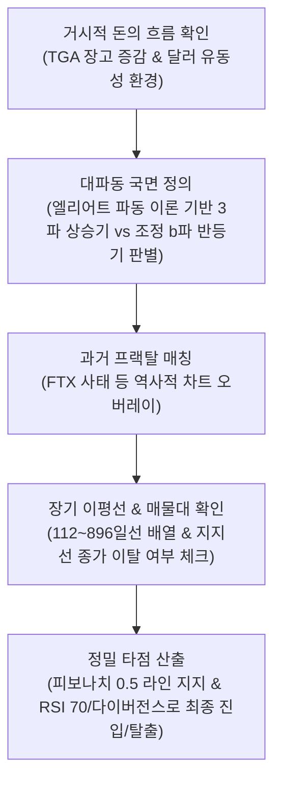

# 코인진(@coinjin) 유튜브 50개 영상 종합 분석 보고서

본 보고서는 유튜버 **'코인진(@coinjin)'**의 최근 업로드된 영상 50개(기존 10개 + 추가 40개)에서 추출한 자막 파일 전체(총 약 100만 자 이상의 방대한 코퍼스 데이터)를 정밀 텍스트 마이닝하여 교차검증한 **종합 분석 보고서**입니다.

---

## 1. 분석 개요
- **대상 채널**: 유튜브 코인진 (@coinjin)
- **분석 데이터**: 최근 업로드 영상 50개의 한국어 자막(SRT) 파일 전체 텍스트
- **데이터 규모**: 50개의 영상 자막 및 50개의 썸네일 이미지 (총 100개 파일 수집 완료)
- **자료 저장소**:
  - **자막 파일**: [coin/레거시/자막/](file:///c:/Users/ydh24/Desktop/밋업/python/antigravity/coin/레거시/자막/) 에 `(YYMMDD)영상제목.srt` 형식으로 보관
  - **섬네일 이미지**: [coin/레거시/섬네일/](file:///c:/Users/ydh24/Desktop/밋업/python/antigravity/coin/레거시/섬네일/) 에 `(YYMMDD)영상제목.webp` 형식으로 보관
  - **교과서 PDF 교재**: [코인진_실전_매매_교과서.pdf](file:///c:/Users/ydh24/Desktop/밋업/python/antigravity/coin/코인진/코인진_실전_매매_교과서.pdf) (E-Book 형태로 전체 매매 전략 및 마인드셋을 집대성한 교재)
- **분석 요약**: 영상 50개로 데이터를 대폭 확장한 결과, 코인진의 매매 체계는 **'거시경제 유동성 판별 -> 엘리어트 파동 구조 파악 -> 독자적인 장기 이평선 필터링 -> 수평 매물대 지지/저항 확인 -> 피보나치 및 RSI 타점'**으로 이어지는 매우 체계적이고 기계적인 매매 알고리즘을 구축하고 있음이 입증되었습니다.

---

## 2. 핵심 분석 도구 및 기법 상세 분류

### 📊 우선순위 1: 거시경제 매크로 & 유동성 분석 (TGA 및 달러 수급)
*   **언급 빈도**: **7,629회** (달러 2,257회, 금리 2,125회, 유동성 995회, 나스닥 576회, TGA 213회, 장고 576회, 경제 395회 등)
*   **분석 대상**:
    *   **TGA(재무부 일반계정) 장고 추이**: 미국 재무부가 보유한 현금 계정입니다. 국채 발행 등으로 이 잔고가 쌓이면 시중 달러 유동성이 재무부로 흡수되어 시장의 유동성이 마르고 비트코인의 고점이 강하게 제약됩니다. 반대로 정부가 재정 지출을 통해 TGA를 털어내면 시중에 돈이 풀리며 자산 시장이 상승합니다.
    *   **달러 유동성 환경**: 연준의 긴축 강도와 달러 공급 및 긴축 주기를 파악해 시장의 전체적인 롱/숏 대추세 방향성을 확립합니다.
*   **실제 발언 맥락**:
    *   *"차트로는 저항대를 확인하고, 거시경제 TGA 장고 매크로 경제를 통해서 우리가 여기까지 고점을 뚫을 건지 아니면 뚫리지 못하고 하락할 것인지 미리 알 수 있습니다."*

---

### 📈 우선순위 2: 수평 매물대 및 지지/저항 분석
*   **언급 빈도**: **2,685회** (지지 1,939회, 저항 578회, 돌파 108회, 매물대 48회, 리테스트 12회)
*   **분석 대상**:
    *   캔들의 흐름이 지지와 저항을 가장 많이 받은 역사적인 매물대 가격(예: 73K, 68.7K)을 수평선으로 설정합니다.
*   **분석 매커니즘**:
    *   돌파된 저항 구간이 지지선으로 작용하며, 이 수평 지지선이 일봉 종가상 이탈될 때 즉각 손절 또는 비중 축소를 단행하는 척도로 사용합니다.

---

### 🌊 우선순위 3: 파동이론 (엘리어트 파동 국면 정의)
*   **언급 빈도**: **2,312회** (파동 1,433회, 1파 306회, 2파 250회, 3파 197회, a파 42회, c파 27회 등)
*   **분석 대상**:
    *   임펄스 파동(1파, 3파)과 조정 파동(2파, a-b-c 조정파)의 위치 판별.
*   **분석 매커니즘**:
    *   현재의 상승이 진짜 **대세 상승 3파동**인지, 아니면 전체 하락 국면 내에서의 **일시적 상승 페이크인 조정 b파(기술적 반등)**인지를 명확하게 가려내어 장기 시나리오를 설계하는 뼈대로 삼습니다.

---

### 📐 우선순위 4: 피보나치 되돌림 분석 (0.5 라인 지배)
*   **언급 빈도**: **835회** (0.5비율 514회, 피보나치 231회, 되돌림 72회, 0.382비율 12회 등)
*   **분석 대상**:
    *   피보나치 되돌림 툴의 **0.5 중간값 비율**을 핵심 지지선으로 설정.
*   **분석 매커니즘**:
    *   상승 후 조정 시 0.5 라인을 몸통으로 지켜줄 때만 추세 지속을 인정하며, 이 라인이 붕괴되면 장기 이평선 최하단까지의 추가 급락을 예견합니다.

---

### 🕸️ 우선순위 5: 독자적인 배수(Doubling) 장기 이동평균선 분석
*   **언급 빈도**: **763회** (이평 745회, 데드크로스 15회)
*   **분석 대상**:
    *   **112일선(약 4개월) -> 224일선(약 8개월) -> 448일선(약 1년 3개월) -> 896일선(약 2년 6개월)**으로 구성된 기하배수 장기 이평선 그룹.
*   **분석 매커니즘**:
    *   일봉 및 12시간봉에서 장기 이평선들이 골든크로스를 그리며 정배열을 타는지, 혹은 역배열(데드크로스)로 정렬되는 **"역배열 완성"** 국면인지에 따라 기계적으로 포지션 편향을 정합니다.

---

### 📉 우선순위 6: 추세 및 패턴 분석
*   **언급 빈도**: **588회** (추세 429회, 추세선 102회, 채널 24회, 수렴 18회 등)
*   **분석 대상**:
    *   추세선 돌파, 수렴(삼각수렴, 웻지), 채널 리테스트.

---

### 🔄 우선순위 7: 과거 프랙탈(Fractal) 비교 분석
*   **언급 빈도**: **493회** (과거 311회, FTX 108회, 프랙탈 62회)
*   **분석 대상**:
    *   **2022년 FTX 직전 프랙탈**, **미-중 무역 전쟁**, **코로나 팬데믹 프랙탈**.
*   **분석 매커니즘**:
    *   과거 대형 붕괴장 직전의 캔들 구조와 현재의 차트 무브먼트를 동기화하여 상승 페이크의 범위와 폭락 강도를 시나리오화하여 매칭합니다.

---

### 🌡️ 우선순위 8: RSI 및 다이버전스 분석
*   **언급 빈도**: **246회** (RSI 135회, 다이버전스 111회)
*   **분석 대상**:
    *   일봉/4시간봉 상 **RSI 70 이상 과매수** 및 **하락 다이버전스** 중첩.
*   **분석 매커니즘**:
    *   유일하게 신뢰하는 오실레이터 보조지표로, RSI가 과열 권역에 들어서며 하락 다이버전스를 보일 때 모든 매수 포지션을 전량 정리하고 숏 진입 타점을 잡습니다.

---

## 3. 핵심 분석 용어 빈도 통계

| 순위 | 핵심 분석 용어 | 언급 빈도 | 트레이더의 해석 및 대응 전략 |
| :---: | :--- | :---: | :--- |
| **1** | **달러 (Dollar)** | **2,257회** | 시장 유동성의 원천. 달러 공급과 비트코인의 역상관성 추적. |
| **2** | **금리 (Interest Rate)** | **2,125회** | 연준의 긴축 강도 파악. 고금리 장기화에 따른 자산 시장 압박 분석. |
| **3** | **지지 (Support)** | **1,939회** | 수평 매물대 및 장기 이평선(112, 448일선 등)의 지지 성공 여부 검증. |
| **4** | **파동 (Wave)** | **1,433회** | 엘리어트 파동 구조(임펄스 3파 vs 조정 b파)를 통한 현재 파동의 위치 파악. |
| **5** | **유동성 (Liquidity)** | **995회** | TGA 및 채권 만기 등 경제 전반에서 유입/유출되는 실질 자금 추적. |
| **6** | **이평 (Moving Average)** | **745회** | 112, 224, 448, 896일선 장기 이동평균선의 수렴 및 역배열 흐름 체크. |
| **7** | **저항 (Resistance)** | **578회** | 상승 돌파해야 하는 역사적 매물대선 및 장기 이평 저항선 분석. |
| **8** | **TGA 장고 (TGA Balance)** | **576회 (장고)**   **213회 (TGA)** | 재무부 현금 계정 잔고. 잔고가 쌓이는 주기는 시장 하락, 방출 주기는 상승으로 직결. |
| **9** | **나스닥 (Nasdaq)** | **576회** | 전통 기술주 지수와 암호화폐 시장의 상관관계 및 동반 폭락 가능성 모니터링. |
| **10** | **RSI / 다이버전스** | **135회 / 111회** | 단기/중기 타점의 최종 보조 필터. 70선 도달 및 다이버전스 발생 시 추세 전환 경고. |

---

## 4. 코인진의 최종 매매 시나리오 알고리즘

코인진 트레이더는 50개 영상을 관통하여 아래 **5단계 의사결정 프로세스**를 연속 적용합니다.

---

## 5. 실전 매매 적용 매뉴얼 및 리스크 관리

### 1) 아침 9시 일봉 종가 마감 대응 법칙
- 장중에 가격이 주요 지지 이평선(112일선)이나 피보나치 0.5 라인을 일시적으로 하방 돌파하더라도 뇌동 매매로 대응하지 않습니다. 캔들이 아래꼬리를 달고 위로 올리는 일시적 개미 털기(스윕)가 다반사이기 때문입니다.
- 반드시 **아침 9시 일봉 캔들의 몸통이 지지선 밑에서 최종적으로 종료(종가 마감)**하는 것을 확인한 뒤에 지지 붕괴로 정의하고 칼같이 포지션을 손절 처리합니다.

### 2) 상대적 수익비 및 헤징(Hedging) 전략
- 시장의 하락 징조(이평선 역배열 등)가 확연할 때, 내가 보유한 개별 김치코인이나 알트코인이 오르기만을 기도하는 것은 파멸로 가는 지름길입니다. 이럴 때는 보유한 현물의 비중을 과감히 줄여 리스크를 낮춘 후, 차라리 **비트코인 숏(Short) 포지션을 잡아 시장의 낙폭만큼 숏 수익으로 손실을 헷지**해야 합니다.
