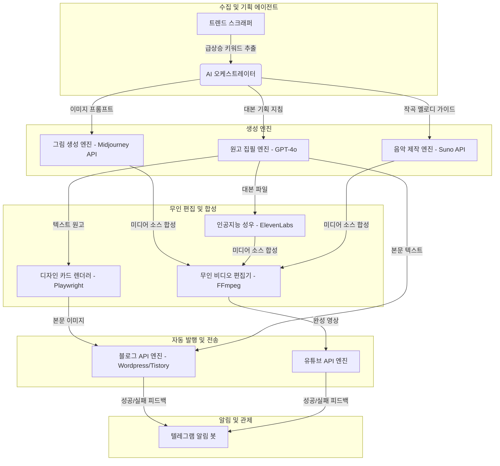

# 🗺️ 100% 무인 수익 자동화 시스템 업그레이드 기획서

이 문서는 기존 유튜버가 배포한 반자동 도구(데스크톱 GUI, 수동 클릭, 복사-붙여넣기 방식)의 한계를 극복하고, **24시간 백그라운드에서 스스로 작동하는 무인 수익 자동화 엔진**으로 구축하기 위한 아키텍처 기획서입니다.

---

## 📌 1. 프로젝트 목표 (Goal)

* **인적 개입 제로화 (Zero-Touch)**: 원고 복사, 버튼 생성, 이미지 다운로드 등 모든 수동 작업을 자동 명령 코드로 교체합니다.
* **쿠키 세션 안정성 확보**: 세션 만료로 자주 끊기는 웹 화면 자동화(Selenium) 방식을 정식 API 통신 및 토큰 방식으로 전환합니다.
* **클라우드 24시간 가동**: 개인 컴퓨터를 켜두지 않아도 가상 서버(VPC)를 통해 365일 실시간 트렌드 수집부터 자동 발행까지 수행합니다.

---

## 🏗️ 2. 현행 반자동 vs 목표 전체 자동화 비교

| 영역 | 현행 시스템 (반자동) | 목표 업그레이드 시스템 (100% 자동) |
| :--- | :--- | :--- |
| **작동 환경** | 내 개인 컴퓨터 (실행 시 PC 켜둠 필요) | 구름(클라우드) 가상 서버 (24시간 무중단) |
| **트렌드 수집** | 유튜버 분석기 프로그램 실행 후 수동 검색 | 실시간 검색 순위 및 쇼핑 데이터 1시간 주기 자동 수집 |
| **원고 작성** | 스타일러 프로그램에 키워드 입력 후 수동 대기 | 스케줄러가 키워드 감지 후 인공지능 원고 자동 집필 |
| **시각 디자인** | 감마AI 및 미드저니 웹페이지에서 수동 다운로드 | 미드저니 API 호출 및 사전 정의된 디자인 코드 자동 렌더링 |
| **채널 발행** | 블로그 에디터에 HTML 코드 복사-붙여넣기 | 블로그 플랫폼 공식 API를 통한 백그라운드 즉시 발행 |
| **영상 제작** | 편집기(디노 5.5 등)에서 자막 및 음성 수동 배치 | 스크립트 기반 FFmpeg 무인 비디오 합성 및 유튜브 자동 전송 |
| **장애 대응** | 프로그램이 멈추면 사용자가 화면을 보고 수동 재시작 | 에러 발생 시 자동 재시도 및 텔레그램으로 실시간 상황 보고 |

---

## 🗺️ 3. 시스템 아키텍처 및 작업 이동 경로

---

## 🛠️ 4. 도구별 세부 업그레이드 방안 (살 붙이기)

### 1) 키워드 및 원고 기획 (스타일러 프로 ➡️ 백엔드 서비스화)
* **기존 방식**: 사용자가 키워드를 발굴해 엑셀로 정리한 뒤 스타일에 수동 입력.
* **업그레이드**: 
  * Python 기반의 **트렌드 감시 봇**이 구글 트렌드 및 네이버 쇼핑커넥트 인기 상품 API를 1시간 주기로 감시.
  * 신규 키워드가 발견되면 AI 비서가 글의 목차 구조(대주제, 소주제)를 자동 기획하고 원고를 비동기식으로 작성.

### 2) 이미지 및 카드 뉴스 (감마AI ➡️ 디자인 코드 자동 렌더링)
* **기존 방식**: 감마AI에 접속해 목차를 입력하고 카드를 수동 생성한 뒤 다운로드하여 배치.
* **업그레이드**:
  * 사전에 세련된 **HTML/CSS 카드 뉴스 템플릿**을 제작.
  * AI가 작성한 문맥 정보를 이 템플릿에 주입하고, **Playwright**(웹 브라우저 제어 라이브러리)를 백그라운드로 구동하여 눈에 띄는 고품질 안내 카드를 PNG 파일로 초고속 자동 렌더링.

### 3) 영상 자동 편집 (디노 5.5 및 캡컷 ➡️ FFmpeg 합성 엔진)
* **기존 방식**: 수동 모드 체크 후 이미지와 오디오 파일을 로드하고 자막 싱크 및 영상 길이 수동 편집.
* **업그레이드**:
  * 생성된 대본 텍스트를 **ElevenLabs API**로 보내 목소리 음성 파일을 무인 생성.
  * 음성 파일의 파형(시간 정보)을 분석하여 자막 싱크 데이터를 담은 자막 파일(.srt)을 생성.
  * **FFmpeg** 라이브러리를 통해 `이미지 + 자막 + 오디오 + 배경음`을 한 번에 결합하여 사람이 편집기를 켜지 않아도 완전한 MP4 비디오 파일 완성.

### 4) 외부 유입 연동 (스레드 생성기 & 지식인 봇 ➡️ 무인 분산 배포)
* **기존 방식**: 글 발행 성공 후 사용자가 주소를 복사해 지식인 답변이나 스레드 입력창에 수동 등록.
* **업그레이드**:
  * 블로그에 글이 성공적으로 발행되면, 데이터베이스(저장소)가 트리거(신호)를 감지.
  * 단축 주소 서비스 API를 통해 긴 주소를 초고속 단축하고, 스레드 API를 직접 호출해 관련 유입용 텍스트와 링크를 자동으로 배포.

---

## 📅 5. 단계별 구축 로드맵 (Roadmap)

### 1단계: 블로그 API 및 수집 무인화 (기초 다지기)
* [ ] 실시간 트렌드 및 쇼핑 품목 키워드 자동 수집 코드 구축
* [ ] 블로그스팟 / 워드프레스 API 즉시 포스팅 모듈 작성
* [ ] 텔레그램 동작 알림 봇 연동

### 2단계: 미디어 무인 생성 및 편집 자동화 (핵심 구현)
* [ ] ElevenLabs 기반 목소리 무인 합성 스크립트 개발
* [ ] HTML 템플릿을 활용한 가독성 높은 카드 뉴스 이미지 렌더러 구축
* [ ] FFmpeg 기반 비디오/자막/오디오 완전 자동 믹싱 엔진 구현

### 3단계: 통합 스케줄러 및 클라우드 배포 (서버 안정화)
* [ ] 클라우드 서버(AWS 등) 환경에 소스 코드 통합
* [ ] 24시간 가동 스케줄러(APScheduler) 세팅
* [ ] 예외 처리 및 에러 재시도 로직 강화

---

💡 **대표님 가이드**: 이 문서를 바탕으로 가장 먼저 시작하고 싶으신 핵심 모듈(예: 1단계의 '실시간 키워드 수집 및 블로그 API 자동 포스팅')을 지정해 주시면 해당 뼈대에 상세 코드와 데이터 명세를 덧붙여 나가겠습니다!
