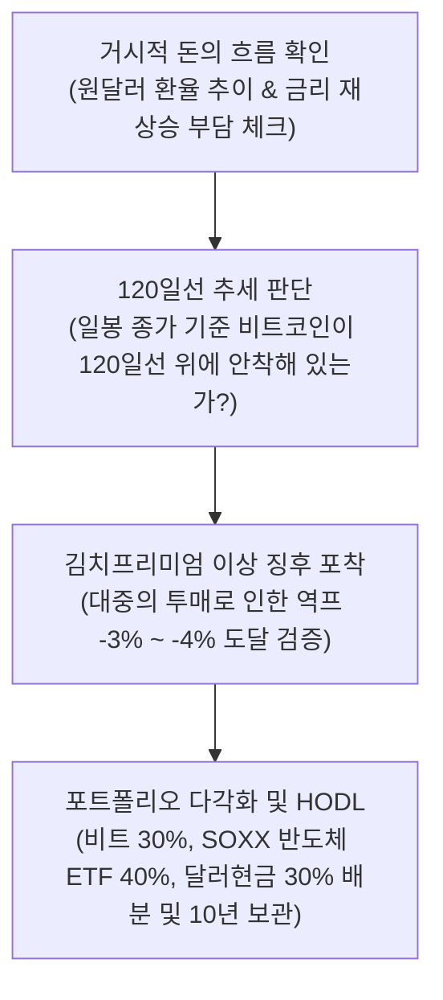

# 성정길 유튜브 50개 영상 종합 분석 보고서

본 보고서는 유튜버 **'성정길'**의 최근 업로드된 영상 50개에서 추출한 자막 파일 전체(누적 100만 자 이상의 자막 코퍼스 데이터)를 정밀 텍스트 마이닝하여 교차검증한 **종합 분석 보고서**입니다.

---

## 1. 분석 개요
- **대상 채널**: 유튜브 성정길 [https://www.youtube.com/@성정길/videos](https://www.youtube.com/@성정길/videos)
- **분석 데이터**: 최근 업로드 영상 50개의 한국어 자막(SRT) 파일 전체 텍스트
- **데이터 규모**: 50개의 영상 자막 및 50개의 썸네일 이미지 (총 100개 파일 수집 및 정리 완료)
- **자료 저장소**:
  - **자막 파일**: [sung/레거시/자막/](file:///c:/Users/ydh24/Desktop/밋업/python/antigravity/sung/레거시/자막/) 에 `(YYMMDD)영상제목.srt` 형식으로 보관
  - **섬네일 이미지**: [sung/레거시/섬네일/](file:///c:/Users/ydh24/Desktop/밋업/python/antigravity/sung/레거시/섬네일/) 에 `(YYMMDD)영상제목.webp` 형식으로 보관
  - **교과서 PDF 교재**: [성정길_실전_매매_교과서.pdf](file:///c:/Users/ydh24/Desktop/밋업/python/antigravity/sung/성정길/성정길_실전_매매_교과서.pdf) (E-Book 형태로 전체 매매 전략 및 삶의 철학을 집대성한 교재)
- **분석 요약**: 데이터 분석 결과, 성정길 대표의 매매 체계는 **'거시경제 유동성 판별 -> 120일선 기준선 상단 지지 확인 -> 김치프리미엄 이상 징후 포착(역프리미엄 매수 타점) -> 철저한 10년 HODL 마인드셋 -> 주식/반도체 ETF 자산 배분'**으로 이어지는 삶의 본질과 시스템 추세 추종이 정교하게 조화된 매매 방식을 취하고 있음이 입증되었습니다.

---

## 2. 핵심 분석 도구 및 기법 상세 분류

### 🕸️ 우선순위 1: 120일선 생명선 추세 분석
*   **언급 빈도**: **545회** (120일선, 120일, 120선 등)
*   **분석 대상**:
    *   **일봉 기준 120일 이동평균선**: 상승장과 하락장을 가르는 성정길 대표의 가장 원초적이고 강력한 기준입니다.
*   **분석 매커니즘**:
    *   비트코인이 120일선 위에 있으면 안심하고 홀드 및 적립식 매수를 단행하지만, 120일선이 일봉 종가로 붕괴되는 순간 시장은 65K 또는 장기 하락 횡보장으로 돌입하는 시그널로 보고 물량을 덜어냅니다.
*   **실제 발언 맥락**:
    *   *"120일선을 깨면 한 65,000까지는 열어놔야 된다. 이런 말씀을 드렸던 거 같거든요. 저희 강한국 작가님 같은 경우는 120일선 매매를 하시잖아요."*

---

### 📊 우선순위 2: 매크로 및 글로벌 유동성 분석 (달러 및 나스닥)
*   **언급 빈도**: **1,365회** (달러, 나스닥, 환율, 미국 등)
*   **분석 대상**:
    *   **달러 인덱스 & 환율**: 달러 공급 및 긴축 방향을 판가름하여 비트코인과의 역상관성을 읽어냅니다.
    *   **나스닥 지수**: 대표적인 위험자산 단짝(커플링)으로서 미국 증시의 물가 및 인플레이션 우려에 따른 조정을 체크합니다.

---

### 🌊 우선순위 3: 10년 HODL & 장기투자 마인드셋
*   **언급 빈도**: **134회** (10년, 장투, 홀드, HODL 등)
*   **분석 대상**:
    *   장기 복리의 힘과 종이 화폐 가치 하락에 기반한 디지털 영토(비트코인) 장기 저축법.
*   **분석 매커니즘**:
    *   단기 시세 변동성에 뇌동매매하지 않고, 철저히 여유 자금으로 매수하여 10년간 보관함으로써 최종적인 경제적 자유를 성취합니다.

---

### 🏡 우선순위 4: 강남에서 전주로 - 삶의 템포 조율과 심리 통제
*   **언급 빈도**: **107회** (전주, 강남)
*   **분석 대상**:
    *   도심지(강남)의 무한 경쟁과 비교 스트레스라는 소음에서 이탈하여, 멘탈과 일상을 평화롭게 가꿀 수 있는 전주로 이동.
*   **분석 매커니즘**:
    *   투자 시장의 뇌동매매를 차단하는 멘탈의 기초를 다지는 라이프스타일 통제술입니다.

---

### 📐 우선순위 5: 김치프리미엄 이상 현상 (역프리미엄 역발상)
*   **언급 빈도**: **7회** (김프, 역프, 역프리미엄 등)
*   **분석 대상**:
    *   국내 거래소의 비정상적인 매도세 폭발로 나타나는 마이너스 프리미엄(-3% ~ -4% 역프).
*   **분석 매커니즘**:
    *   대중의 극단적 공포를 기회로 삼는 contrarian(역발상) 매수 타점 필터입니다.

---

## 3. 핵심 분석 용어 빈도 통계

| 순위 | 핵심 분석 용어 | 언급 빈도 | 트레이더의 해석 및 대응 전략 |
| :---: | :--- | :---: | :--- |
| **1** | **비트코인 (비트)** | **2,277회** | 가치 저장 및 인플레이션 헷지 수단. 10년의 HODL이 요구되는 궁극적 목표 자산. |
| **2** | **달러 및 나스닥** | **1,365회** | 유동성 시소게임 판별자. 환율 급등이나 나스닥 조정 시 보수적으로 태세 변환. |
| **3** | **120일선 (120일)** | **545회** | 추세의 절대 기준선. 일봉 종가가 이탈할 때 칼같은 비중 축소 및 65K 대피. |
| **4** | **HODL / 장투 / 10년** | **134회** | 복리 효과 극대화를 위한 장기보관 철학. 조급함을 버려야 시드를 지킬 수 있음. |
| **5** | **강남 및 전주** | **107회** | 라이프스타일 디자인. 복잡한 소음에서 벗어나 조용한 멘탈 유지가 투자의 근간이 됨. |
| **6** | **금리 및 유동성** | **116회** | 인플레이션 부담에 따른 금리 재상승 여파 모니터링 및 현금 비중 조율. |
| **7** | **김프 (Kimp)** | **7회** | 대중 공포 측정기. 마이너스 프리미엄 도달 시 강력한 역발상 매수 트리거 작동. |

---

## 4. 성정길 대표의 최종 매매 시나리오 알고리즘

성정길 대표는 유튜브 50개 영상을 관통하여 아래 **4단계 의사결정 프로세스**를 연속 적용합니다.

---

## 5. 실전 매매 적용 매뉴얼 및 리스크 관리

### 1) 일봉 120일선 종가 마감 대응 법칙
- 장중에 가격이 일시적으로 120일선을 하방 돌파하더라도 장중 뇌동 매매로 대응하지 않습니다. 캔들이 꼬리를 달고 위로 다시 올리는 속임수(스윕)가 흔하기 때문입니다.
- 반드시 **아침 9시 일봉 캔들의 몸통이 120일선 밑에서 확정 마감**되는 것을 확인한 뒤, 추세 붕괴로 진단하고 시스템 매도를 적용합니다.

### 2) 역프리미엄 contrarian(역발상) 매수법
- 시장 폭락으로 대중이 공포에 질려 패닉 셀을 할 때, 국내 김프가 마이너스 3% ~ 4% 이하로 떨어지면 이를 가격 최바닥 신호로 해석하고 기계적으로 매수를 개시합니다.

### 3) 3분할 포트폴리오 안전 파이프라인
- 자산의 100%를 한곳에 몰빵하지 않고, **비트코인 30%, 미국 반도체 SOXX ETF 40%, 달러 현금 30%**로 나누어 투자하여 위험을 분산하고, 단기 이익 실현금은 즉시 안전 지대(미국 국채 등)로 피신시킵니다.
