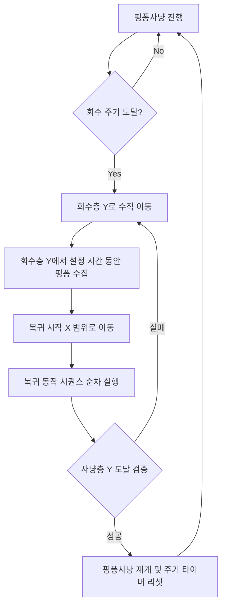

# Feature Specification: Pingpong Hunt & Loop Hunt V3

이 문서는 핑퐁사냥(구 좌우이동) 및 순환사냥 V2(V3 확장)의 핵심 기능 범위와 동작 규칙을 정의합니다.

---

## 1. 핑퐁사냥 (Pingpong Hunt)

### 1.1 기본 동작
* 지정된 미니맵 X 영역의 최소값(`x_min`)과 최대값(`x_max`) 경계를 지속적으로 왕복하며 전투를 진행합니다.
* 경계 도착 시, 설정된 복층 사냥 여부에 따라 방향전환 시 텔레포트 상승을 지정 횟수만큼 연계하여 수행할 수 있습니다.

### 1.2 아이템 회수 모드 (Item Recovery Mode)
핑퐁사냥 수행 중 일정 주기마다 아이템을 수집하기 위해 특정 회수층으로 이동한 후 사냥층으로 복귀하는 기능입니다.

* **회수 주기 (`recovery_interval`)**: 사용자가 지정한 시간(초) 간격으로 회수 시퀀스를 구동합니다.
* **회수 시간 (`recovery_duration`)**: 회수층에 도착한 뒤, 해당 층에서 수집 동작을 수행하는 시간(초)입니다.
* **사냥층 Y (`hunt_y`) / 회수층 Y (`recovery_y`)**: 사냥이 기본적으로 진행되는 층과 아이템을 회수하기 위해 낙하 또는 상승해야 하는 목적지 층의 Y좌표입니다.
* **복귀 X 범위 (`[return_x_min, return_x_max]`)**: 복귀 시퀀스 동작(예: 사다리/로프 기어 타기, 수직 점프 지점 등)을 실행할 수 있는 시작 X좌표의 범위입니다.
* **로프 상승 시간 (`rope_climb_time`)**: 복귀 시퀀스 명령어 중 `ROPE_UP` 동작을 수행할 때, 위 방향키(`up`)를 누르고 있을 유지 시간(초)을 소수점 첫째자리까지 커스텀 지정할 수 있습니다.
* **복귀 시퀀스 (`return_sequence`)**: 복귀 X 범위에 도달했을 때 위층으로 가기 위해 순차적으로 실행할 키 매크로 명령어 체인입니다. (예: `TELE_UP, ROPE_UP, TELE_UP`)
  * **지원 명령어**: `TELE_LEFT`, `TELE_RIGHT`, `TELE_UP`, `JUMP_LEFT`, `JUMP_RIGHT`, `JUMP_UP`, `WALK_LEFT`, `WALK_RIGHT`, `DROP`, `ROPE_UP`

---

## 2. 순환사냥 V2 (V3 확장)

### 2.1 웨이포인트 순환 (슬롯 간 연결식 이동 방식)
* 최대 30개의 웨이포인트를 생성하여 슬롯별로 순차 이동하며 사냥을 진행합니다.
* 이동방식은 슬롯 자체의 종속 속성이 아니라, **"현재 슬롯 → 다음 슬롯으로의 연결 정보"**로 관리됩니다 (예: 슬롯 1의 `move_type`은 슬롯 1에서 슬롯 2로 이동하는 방식).

### 2.2 안착 판정 및 즉시 안착 (V3)
* 캐릭터의 Y좌표가 목적지 Y와 정확히 일치하지 않더라도, **오차범위 `+-8px` 이내**로 완화하여 검증합니다.
* 캐릭터의 현재 좌표가 슬롯 목표 범위 내에 진입하면 지체 없이 **즉시 안착 처리**를 수행합니다.
  * 즉시 모든 이동 키 입력을 해제(릴리즈)하고 안착하여 체류 사냥(`stay_time`)을 실행합니다.

### 2.3 슬롯 이동 제어 우선순위 및 보호 잠금
* **이동방식 우선 적용**: 슬롯 체류 사냥이 종료되면 다음 목적지 슬롯으로의 이동방식(TELEPORT, JUMP, DROP 등)을 1회 즉시 우선 실행합니다.
* **이동 보호 잠금 (0.8초)**: 전환 이동방식 작동 직후 캐릭터가 떨어지거나 공중에 떠 있는 물리 이동 시간(0.8초) 동안에는 보조 이동(보정) 로직의 개입을 완전히 잠금(차단)하여 오동작을 방지합니다.
* **보조 이동 (보정)**: 0.8초 보호 잠금 시간이 지난 후에도 목표 범위에 안착하지 못한 경우에만, 좌표 기반의 보조 보정 이동(Y축 정렬 우선, 그 후 X축 보정)이 실행됩니다.

### 2.4 명시적 이동 방식 (Explicit Move Modes)
* 텔레포트와 점프/걷기의 세분화된 조합 방식을 지원합니다:
  * `TELE_LEFT` / `TELE_RIGHT` / `TELE_UP`
  * `JUMP_LEFT` / `JUMP_RIGHT` / `JUMP_UP`
  * `WALK_LEFT` / `WALK_RIGHT`
  * `DROP` (하단 점프 낙하)

### 2.5 비상 수직 이동 복귀
* Y축 정렬 및 목적지 이동 시도가 연속 4회 이상 실패하여 제자리에 갇힌 것으로 감지되면, 무작위 좌우 방향으로 0.3초간 긴급 이동한 후 다음 웨이포인트로 목적지를 강제 전환하여 매크로 고사(Stuck) 상태를 예방합니다.

---

## 3. UI 단축키 및 제어 규칙

| 단축키 | 기능 명칭 | 세부 설명 |
| :--- | :--- | :--- |
| **F4** | 사냥 경로 녹화 토글 | 경로 녹화 기능을 켜거나 끕니다. (실행 중인 사냥은 자동 정지됩니다.) |
| **F5** | 사냥 시작 | 현재 설정된 모드로 자동 사냥을 구동합니다. |
| **F6** | 사냥 중지 (긴급 정지) | 사냥 루프를 즉시 멈추고 모든 눌려있던 물리 키 입력을 릴리즈합니다. |
| **F9** | 낚시 좌표 고정 | 낚시 사냥 모드용 타겟 좌표로 현재 캐릭터 위치를 고정합니다. |
| **F2** | 웨이포인트 빠른 등록 | 순환 사냥의 다음 유효 슬롯에 현재 위치 기준 X+-5 범위 및 Y좌표를 저장합니다. |

---

## 4. 설정 자동화 및 영구 저장

* **묵시적 저장 (`save_settings_silently`)**:
  * 미니맵 수동 드래그 지정 완료 시 또는 자동 인식(`auto_detect_minimap`) 완료 시 팝업창 없이 백그라운드에서 즉시 `config.json`에 미니맵 영역 크롭 좌표가 저장됩니다.
* **명시적 저장**:
  * 메인 UI 상단의 "설정 저장" 버튼 클릭 시 현재 UI의 모든 설정값이 프로필명에 매핑되어 영구 보존됩니다.

---

## 5. 개발 지침 및 개발자 준수 사항

### 5.1 미니맵 비주얼 오버레이 정책
* **시각적 일원화**: 사냥 경계(`x_min`, `x_max`) 및 아이템 회수 라인, 텔레포트 포인트 등 핵심 좌표가 설정되는 즉시 미니맵 영역 상에 오버레이 드로잉 형태로 표현되어야 합니다.
* **불투명도(Alpha) 관리**: 사냥구간은 반투명 초록색(`(34, 197, 94)`, 알파 `0.15`), 회수구간은 반투명 노란색(`(0, 234, 255)`, 알파 `0.25`) 가로 띠 형태로 채워 시인성을 극대화하며, 캐릭터 위치 점(`●`) 및 텍스트 마커가 배경 오버레이에 가려지지 않도록 마지막 레이어 단계에 그려야 합니다.
* **텔포포인트 (T) 지시**: 핑퐁사냥 중 복귀를 돕는 텔포포인트는 미니맵 상에 보라색 마커 및 'T' 마크로 항시 시각화하여 디버깅 편의성을 제공합니다.
* **오버레이 정보 격리 (디버그 모드 전용)**: 미니맵 상의 격자 그리드 라인 및 텍스트 정보(캐릭터 좌표, 설정 사냥층, 설정 회수층, 현재 감지층)는 일반 사냥 모드 시 사용자 가독성을 방해하지 않도록 완전히 숨기며, 디버그 모드가 켜진 경우에만 선택적으로 렌더링하도록 격리합니다.

### 5.2 실시간 상태 HUD 가이드라인
* **HUD 박스 구성**: 미니맵 프리뷰의 좌측 상단에 반투명 어두운 상자(알파 `0.6`, 배경색 `(15, 15, 15)`)를 렌더링하고 한글 상태 지시자를 출력합니다. (단, 이 상태 지시자 박스 역시 디버그 모드 활성화 시에만 화면에 렌더링됩니다.)
* **상태 텍스트 통일**: 현재 매크로가 실행 중인 상태를 직관적으로 판독할 수 있도록 상태 텍스트는 다음으로 표준화합니다:
  * 대기 상태: `[대기 중]`
  * 상점 이용: `[상점 판매 중]`
  * 하단/추락 감지: `[하단 사냥 중]`, `[추락 복귀 중]`
  * 핑퐁사냥: `[핑퐁사냥 중]`
  * 핑퐁 회수 모드: `[회수층 이동 중]`, `[아이템 회수 중]`, `[복귀지점 이동 중]`, `[복귀동작 실행 중]`, `[사냥층 복귀 확인 중]`
  * 텔레포트 기동 진행율: 복층 기동 시 현재 상승 횟수를 실시간으로 HUD에 반영합니다 (예: `[텔포상 1/2]`).
  * 순환사냥: `[순환사냥 슬롯 N]` (N은 1부터 시작하는 현재 슬롯 번호)

### 5.3 디버그 로그 정책
* **로그창 점유 최소화**: 주기적으로 수백 ms 단위로 갱신되는 세부 키 지연 및 미세 동작 정보(예: `[공격] [공격 실행] 설정: 500ms...`)는 일반 실행 모드에서 로그창을 어지럽히지 않도록 기본적으로 숨겨야 하며, 디버그 모드가 활성화되어 있을 때만 선택적으로 출력해야 합니다.
* **상태 HUD와의 역할 분담**: 실시간 상태 변화 및 사소한 상태 체크는 로그로 찍지 말고, 미니맵 HUD 박스를 통해 실시간으로 사용자에게 업데이트되도록 설계합니다.

### 5.4 단축키 단일화 및 입력 필드 포커스 정책
* **F2 핫키 단일화**: 좌표를 입력받는 여러 개의 단축키 난립을 피하고 **F2 단축키** 하나로 좌표 가져오기 로직을 일원화합니다.
  * **포커스 연동형 주입(Injection)**:
    * 사용자가 QLineEdit 입력 필드에 포커스를 둔 상태에서 F2 키를 입력하면, 현재 캐릭터 좌표를 기반으로 해당 필드에 적합한 좌표를 자동 연산하여 주입합니다.
    * **마진 자동 생성 규칙 (F2 등록 정책)**:
      * **F2 등록 시 기본 범위는 현재 좌표 기준 ±1 생성** (X/Y 모두 동일 적용).
      * 사냥구간 및 복귀 X 범위 경계값인 `x_min`/`return_x_min` 계열 필드에는 `현재 X - 1`, `x_max`/`return_x_max` 계열 필드에는 `현재 X + 1` 마진 값을 자동으로 대입합니다.
      * Y축 입력창 포커싱 시에도 `y_min` 계열에는 `현재 Y - 1`, `y_max` 계열에는 `현재 Y + 1`을 적용하며, 단일 좌표 필드(`y` 등)일 경우 마진 없이 현재 좌표 그대로 대입합니다.
      * **사용자가 직접 수정한 값은 프로그램이 재보정하지 않고 그대로 유지**합니다 (수동 입력값 우선).
  * **폴백(Fallback)**: 포커스가 활성화된 QLineEdit이 없을 경우, F2 단축키는 기존 순환 사냥의 웨이포인트 빠른 기록 동작으로 안전하게 전환(폴백)됩니다. (단, 이 폴백 기록 시에도 X축 범위는 `현재 X - 1` 및 `현재 X + 1`로 자동 생성됩니다.)

### 5.5 신규 기능 모듈 분리 원칙
* **모듈 고립 및 결합도 최소화**: 매크로 기능 확장이나 새로운 사냥 모드가 추가될 때, 메인 실행 스레드 코드(`AUTOmaple_v1.4.x_LK.py`)를 직접 고치지 않고 핵심 로직을 별도 모듈화하여 `core/game_auto/modules/` 하위 파일에 작성해야 합니다.
* **스레드 세이프 조작**: 백그라운드 핫키나 모니터 스레드에서 PySide6 GUI 요소를 직접 수정하는 것은 예기치 못한 크래시의 원인이 되므로, GUI 변경이 필요한 모든 이벤트는 반드시 Qt Signal 디스패치 구조(`f2_signal` 등)를 경유하여 메인 스레드에서 안전하게 조작되도록 개발해야 합니다.

### 5.6 향후 UI 원칙
* **세로 스크롤 영역 필수 지정**: 신규 탭을 추가하거나 설정 항목을 확장할 때, 저해상도 모니터 및 창 리사이즈 시 UI가 잘리는 문제를 방지하기 위해 모든 설정 탭을 `QScrollArea` 로 감싸 세로 스크롤바를 기본 지원해야 합니다.
* **기능별 그룹박스 분리 및 접이식(Collapsible) 지원**: 설정이 다단으로 길어지면 기능별 그룹박스로 엄격히 격리하고, 접기/펼치기 토글 버튼과 내부 컨테이너의 가시성(`setVisible`) 제어 구조를 적용해 화면 공간을 컴팩트하게 활용합니다.
* **창 크기 동적 확장**: 대규모 설정 폼이 노출되는 모드(예: 핑퐁사냥 모드)가 활성화될 경우, 화면 정렬과 시인성을 위해 메인 윈도우의 세로 최소 높이를 동적으로 늘려주는 피드백 코드를 연동합니다.

### 5.7 [미니맵 정책]
1. **사용자 저장 위치 우선**: 사용자가 저장한 미니맵 위치(`minimap_x`, `minimap_y`, `minimap_width`, `minimap_height`)를 최우선으로 사용하여 사냥을 시작합니다.
2. **자동인식은 보조 수단**: 자동인식 기능은 최초 좌표 설정 또는 좌표 복구 목적으로만 제한하여 활용합니다.
3. **사냥 중 재탐색 금지**: 사냥 가동 전 미니맵 좌표가 한 번 확정되면, 사냥 루프 동작 중에는 미니맵 영역 재탐색을 절대 금지합니다.
4. **일치된 좌표계 사용**: 미니맵 분석 내부 좌표계, UI 입력 필드 수치, 오버레이 가이드 라인 픽셀 좌표계는 완전히 동일한 일차원 픽셀 스케일 단위를 유지해야 합니다.

### 5.8 [순환사냥 정책]
1. **안착 판정 우선**: 캐릭터가 목적 슬롯의 X/Y 허용 범위 내부로 도달하는 즉시 안착 판정을 우선 처리합니다 (이동 판단보다 상위 우선).
2. **슬롯 간 연결식 관리**: 이동방식은 목적지 슬롯의 내장 속성이 아니라 슬롯과 슬롯 사이의 물리 연결 전이 정보(`N → N+1`)로만 바인딩하여 관리합니다.
3. **이동방식 1회 우선 실행**: 이전 슬롯 사냥 종료 직후, 등록된 다음 전이 이동기를 1회 즉시 우선 구동하여 캐릭터를 다음 슬롯 쪽으로 쏘아 보냅니다.
4. **보조 수단으로서의 좌표 보정**: 오차가 지속되어 0.8초의 안착 보호 시간이 지난 경우에만 보조 이동(Y축 정렬 우선, 그 후 X축) 보정을 개입시킵니다.
5. **모듈식 독립 개발**: 확장되거나 리팩토링되는 신규 백엔드 컴포넌트는 메인 실행 스레드의 응집도를 낮추기 위해 별도의 모듈 단위 파일로 고립 개발합니다.

